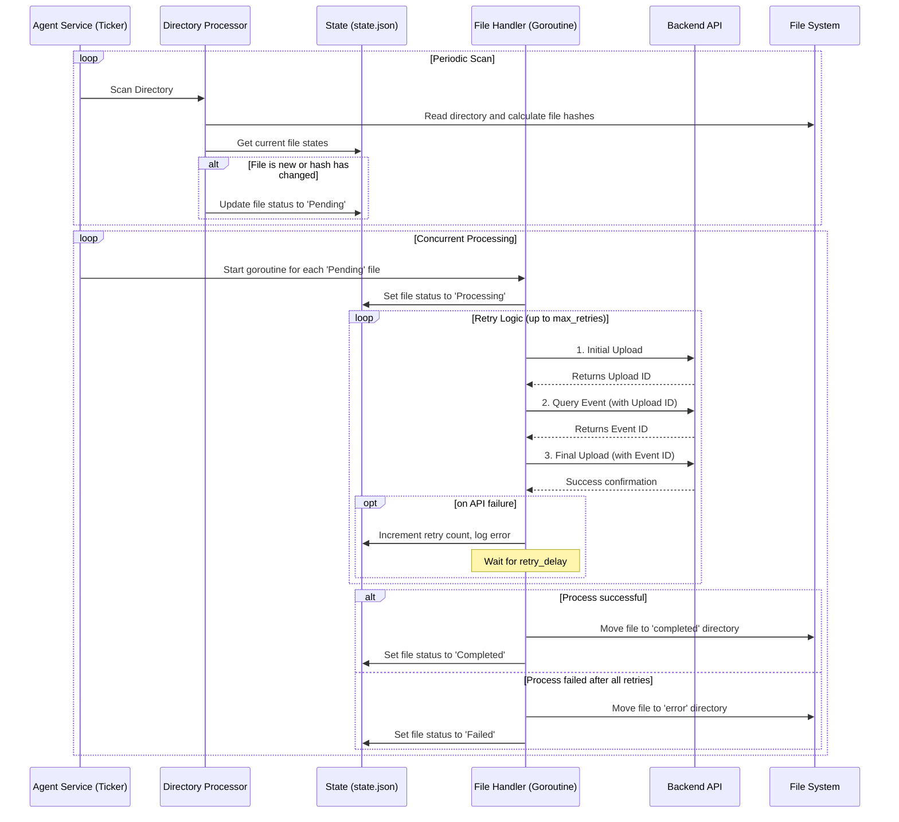

# Go Agent

This agent is a cross-platform (Windows and macOS) application designed to run as a resilient, continuous background service. It monitors a directory for new or modified files and processes them through a multi-step, fault-tolerant workflow.

## Core Responsibilities

- **Directory Monitoring**: The agent periodically scans a configured directory for file changes, using SHA256 hashes to detect modifications.
- **Multi-Step Processing**: For each new or modified file, the agent initiates a concurrent, multi-step process:
    1.  **Initial Upload**: The file is sent to a preliminary API endpoint.
    2.  **Event Query**: The agent queries a second endpoint to determine which event the file is associated with.
    3.  **Final Upload**: The file is sent to a final endpoint, correctly associated with its event.
- **Fault Tolerance**: If any step in the process fails, the agent will retry up to a configurable number of times with a delay between attempts.
- **File Management**:
    -   Successfully processed files are moved to a `completed` directory.
    -   Files that fail after all retry attempts are moved to an `error` directory.
- **State Persistence**: The agent maintains a `state.json` file to track the status (`Pending`, `Processing`, `Completed`, `Failed`), retry count, and last error for each file, ensuring it can resume operations safely after a restart.
- **Resilience**: It is built using the `kardianos/service` library, allowing it to be installed as a system service that starts automatically on boot.

## Workflow Sequence Diagram

The following diagram illustrates the complete workflow for a single file:



## Compilation Instructions

To compile the agent, you need to have Go installed on your system.

### macOS

Open your terminal and run the following command from the `apps/agent` directory:

```sh
go build -o agent cmd/agent/main.go
```

This will create an executable file named `agent` in the `apps/agent` directory.

### Windows

Open your command prompt or PowerShell and run the following command from the `apps/agent` directory:

```sh
go build -o agent.exe cmd/agent/main.go
```

This will create an executable file named `agent.exe` in the `apps/agent` directory.

## Usage and Configuration

Before running the agent, you must configure it properly. The agent loads its configuration from a `config/config.json` file located relative to the executable.

### Directory Structure

The agent expects the following directory structure:

```
/apps/agent/
├── agent(.exe)         <-- The compiled executable
├── config/
│   └── config.json     <-- Configuration file
├── logs/
│   └── app.log         <-- Log file (created automatically)
└── state.json          <-- State file (created automatically)
```

### Configuration Parameters

Edit the `config/config.json` file to match your environment.

```json
{
  "directory_to_watch": "/path/to/your/files",
  "completed_directory": "/path/to/completed/files",
  "error_directory": "/path/to/error/files",
  "initial_upload_endpoint": "http://localhost:8080/upload/initial",
  "event_query_endpoint": "http://localhost:8080/upload/query-event",
  "final_upload_endpoint": "http://localhost:8080/upload/final",
  "check_interval_seconds": 60,
  "http_timeout_seconds": 15,
  "max_retries": 5,
  "retry_delay_seconds": 30
}
```

- `directory_to_watch`: The absolute path to the folder the agent should monitor for new files.
- `completed_directory`: The absolute path where successfully processed files will be moved.
- `error_directory`: The absolute path where files that failed processing will be moved.
- `initial_upload_endpoint`: The API endpoint for the first step of the upload process.
- `event_query_endpoint`: The API endpoint for querying the event ID.
- `final_upload_endpoint`: The API endpoint for the final file upload.
- `check_interval_seconds`: How often (in seconds) the agent scans the directory for changes.
- `http_timeout_seconds`: The timeout (in seconds) for each HTTP request to the API.
- `max_retries`: The maximum number of times the agent will retry a failed processing step.
- `retry_delay_seconds`: The delay (in seconds) between each retry attempt.

### Monitoring the Agent

The agent's activity, including file detections, processing steps, errors, and retries, is logged in the `logs/app.log` file. You can monitor this file to check the agent's status and troubleshoot issues.

## Installation as a System Service

Once the agent is compiled, it can be installed as a system service to ensure it runs automatically on boot. These commands typically require administrative privileges (e.g., run as Administrator on Windows or with `sudo` on macOS).

From the `apps/agent` directory where the executable is located:

- **Install the service:**
  ```sh
  # On macOS
  sudo ./agent install

  # On Windows
  .\agent.exe install
  ```

- **Start the service:**
  ```sh
  # On macOS
  sudo ./agent start

  # On Windows
  .\agent.exe start
  ```

- **Stop the service:**
  ```sh
  # On macOS
  sudo ./agent stop

  # On Windows
  .\agent.exe stop
  ```

- **Uninstall the service:**
  ```sh
  # On macOS
  sudo ./agent uninstall

  # On Windows
  .\agent.exe uninstall
  ```
